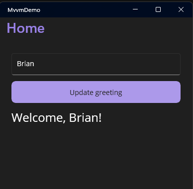

# Assignment: Build a .NET MAUI page using MVVM

## What is MVVM?

MVVM (Model–View–ViewModel) is a UI architectural pattern that cleanly separates an application's user interface from its business logic, making apps easier to test, maintain, and scale. The core idea: the View never directly manipulates data, and the Model never knows about the UI. The ViewModel sits between them, acting as the binding-friendly adapter.

## Learning goals
By the end of this assignment, students should be able to:

- explain what MVVM is and why it is used in .NET MAUI
- understand how the CommunityToolkit.MVVM package simplifies implementing MVVM
- understand the relationship between a command and method that command executes
- setup MVVM from scratch
- extend and enhance an existing MVVM implementation
- understand how the view model is bound to the view

### Create a folder to place a new MAUI app
```bash
# navigate to where you want to create the folder for the new MAUI app

# create the new folder
mkdir MvvmDemo

# change directories to the new folder
cd MvvmDemo

```

### Create a new global.json that pins the MAUI app to the .NET 11 prerelease
```bash
dotnet new globaljson
```

Update the global.json file to include the following.
```json
{
  "sdk": {
    "version": "11.0.100-preview.7.26381.103",
    "allowPrerelease": true,
    "rollForward": "latestMinor"
  }
}
```

### Create a new MAUI app inside the MvvmDemo folder
```bash
dotnet new sln -n MvvmDemo.slnx
dotnet new maui -n MvvmDemoApp -f net11.0
dotnet sln MvvmDemo.slnx add MvvmDemoApp/MvvmDemoApp.csproj

```

### Add CommunityToolkit.MVVM
```bash
cd MvvmDemoApp
dotnet add package CommunityToolkit.Mvvm
cd ..
```

### Model

Create a folder for Models
```bash
mkdir Models
```

Create the GreetingModel
```bash
dotnet new class -n GreetingModel -o Models
```

Replace the contents of the GreetingModel.cs to the following.

```csharp
namespace MvvmDemoApp.Models;

public class GreetingModel
{
    public string Name { get; set; } = string.Empty;
}
```

### ViewModel

Create a folder for ViewModels
```bash
mkdir ViewModels
```

Create the ViewModel
```bash
dotnet new class -n GreetingViewModel -o ViewModels
```

Replace the contents of the GreetingViewModel.cs to the following.


```csharp
using CommunityToolkit.Mvvm.ComponentModel;
using CommunityToolkit.Mvvm.Input;

namespace MvvmDemoApp.ViewModels;

public partial class GreetingViewModel : ObservableObject
{
    [ObservableProperty]
    private string name = string.Empty;

    [ObservableProperty]
    private string greetingText = "Hello!";

    [RelayCommand]
    private void UpdateGreeting()
    {
        if (string.IsNullOrWhiteSpace(Name))
        {
            GreetingText = "Please enter your name.";
            return;
        }

        GreetingText = $"Welcome, {Name}!";
    }
}
```
> Note: C# properties usually consist of a Public property and a private backer field. In the code above there is only private backer fields with  [ObservableProperty] attributes. This is how the CommunityTookit.Mvvm works.  You define the private backer field and decorate it with the ObservableProperty attribute.  When the code is compiled, the Public property is automatically generated for these private fields.  You'll notice that GreetingText is not defined, but it is used in the UpdateGreeting() method.  GreetingText is the name of the Public property that will be automatically generated.  

> Note: Decorating UpdateGreeting() with the [RelayCommand] attribute makes a command named UpdateGreetingCommand available to the bound XAML view.

### Code-behind

Below is the C# code behind for the MainPage.xaml file.  Notice that the BindingContext is being set to an instance of GreetingViewModel.  This makes all public members of the GreetingViewModel to be available for data binding.

```csharp
using MvvmDemoApp.Views;

public partial class MainPage : ContentPage
{
    public MainPage()
    {
        InitializeComponent();
        BindingContext = new GreetingViewModel();
    }
}
```


### View

In the MainPage.xaml, the public Name property of the GreetingViewModel is being bound to the Entry control. The public GreetingText property of the GreetingViewModel is being bound to a label control.  The Button is being bound to UpdateGreetingCommand, which is the UpdateGreeting method in the GreetingViewModel.

```xml
<ContentPage x:Class="MvvmDemoApp.MainPage">

    <VerticalStackLayout Padding="24" Spacing="12">
        <Entry Text="{Binding Name}" Placeholder="Type your name" />
        <Button Text="Update greeting" Command="{Binding UpdateGreetingCommand}" />
        <Label Text="{Binding GreetingText}" FontSize="24" />
    </VerticalStackLayout>
</ContentPage>
```

This example is intentionally small, but it demonstrates the full flow:

1. User types text in the `Entry`
2. The `Name` property updates
3. The user presses the button
4. `UpdateGreetingCommand` runs
5. The `GreetingText` property updates
6. The `Label` refreshes automatically through binding



## Student deliverables

Each student must submit:

- submit a screenshot to Canvas showing the following screens of the running app
  - app before typing into textbox
  - app after typing into textbox, but before pressing button
  - app after pressing button